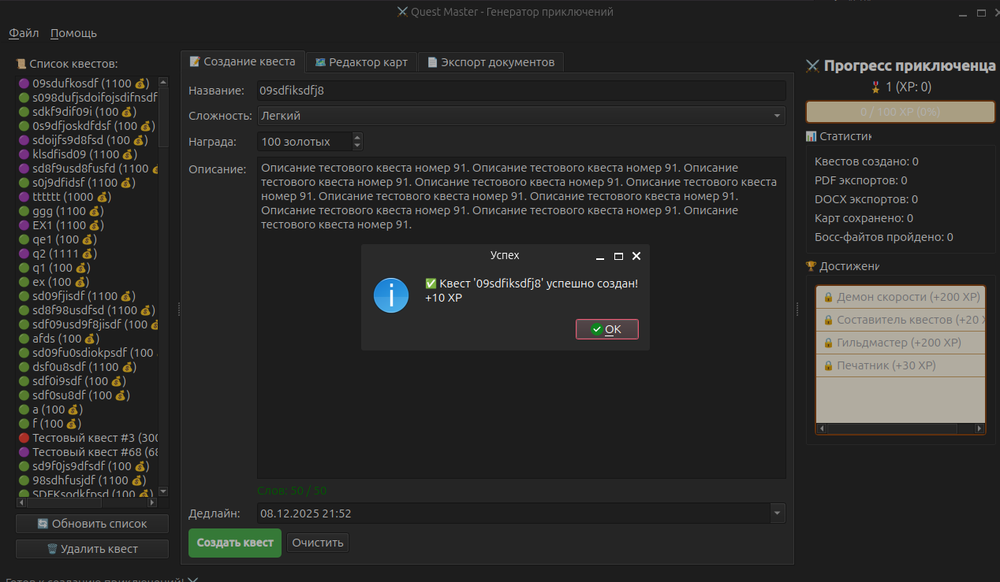
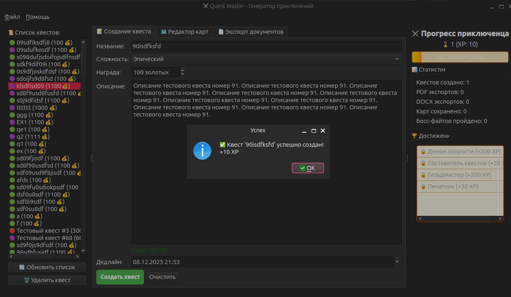
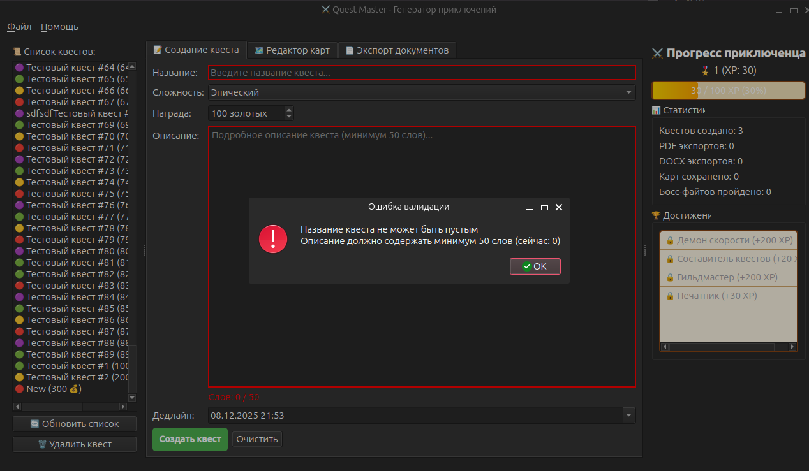

# Quest Master — Generator of Adventures

A compact Python app to create, edit and export fantasy quests. It includes a
small GUI (PyQt6), a lightweight SQLite-backed data layer, a simple
gamification engine, and tools to export quests to PDF/DOCX.

This repo is focused on being easy to run locally and easy to extend: the
core pieces are intentionally small and readable so you can tweak behavior
and add features quickly.

Contents
--------

- `main.py` — application entry (starts the GUI)
- `core/` — backend pieces: database, gamification, and template engine
- `gui/` — PyQt widgets (quest editor, map editor, gamification panel)
- `templates/` — Jinja2 templates used for DOCX/PDF exports
- `tests/` — small scripts and tests (including a performance "boss fight")

Quick links
-----------

- Quick start: `QUICKSTART.md` (short, get-running instructions)
- Requirements: `requirements.txt`

How I helped you
-----------------

- Implemented a simple `Database` wrapper (SQLite) and a small
	`GamificationEngine` so the GUI and tests run out of the box.
- Made template exports resilient to missing optional dependencies so the
	repository can be explored without installing heavy libs.

Next steps you might want
-------------------------

- A simple SQLite `Database` wrapper was added so the GUI and tests can
	store quests locally.
- A light `GamificationEngine` provides XP, levels, stats and small
	achievements used by the UI.
- Template exports are now tolerant of missing optional libs, so you can
	explore the code without installing heavy packages.

Demo
----

Screenshots (relative paths to files in the `assets/` folder):

Want to help or extend the project?
----------------------------------

- Add persistence for the gamification state (right now it's in-memory).
- Add unit tests and a simple CI workflow to run the quick tests automatically.
- If you plan to run the GUI/export features, I can add a small install
	script or a Dockerfile to make setup reproducible.
